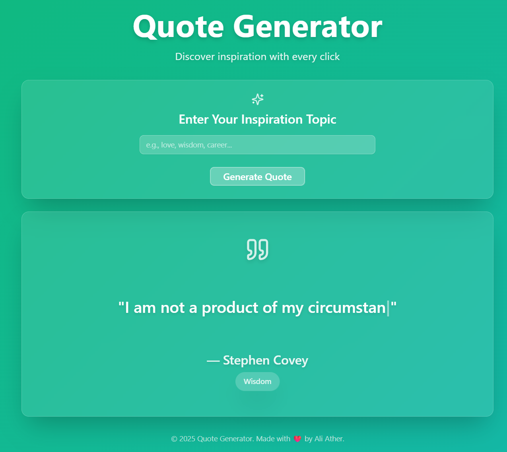
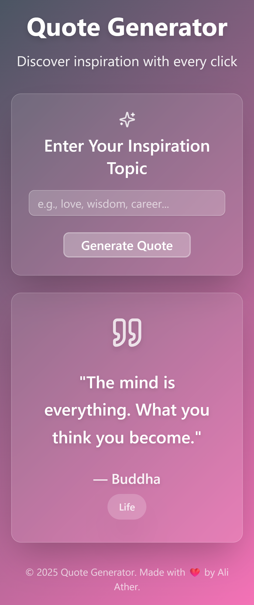

# ✨ Quote Generator Web App

A beautifully crafted quote generator built with modern web technologies. It dynamically generates inspirational quotes with smooth gradients, elegant typography, and a friendly user experience.

---
## 🔗 Live Demo

👉 [Quote Generator](https://quote-generator-ali.vercel.app/)

## 📸 Screenshots
### Desktop View

### Desktop View
 
### Mobile View
<div align="center" >

</div>
 
---

## ⚙️ Tech Stack

This project is built using the following technologies:

- **Next.js 14** 
- **Tailwind CSS** 
- **Shadcn UI** 
- **Vercel** 
- **VS Code** 

---

## 🚀 Features

- 📝 Dynamic quote generation
- 🎨 Gradient backgrounds for visual appeal
- 💬 Typing animation for quote delivery
- 📱 Fully responsive layout
- 🔥 Clean and minimal UI with Shadcn
- ⚡ Deployed on [Vercel](https://vercel.com)

---

## 🧑‍💻 Getting Started

### 1. Clone the Repository

```bash
git clone https://github.com/aliatherayyubi/quote-generator.git
cd quote-generator
```
### 2. Install Dependencies

 pnpm install

### 3. Run the Development Server

npm run dev

